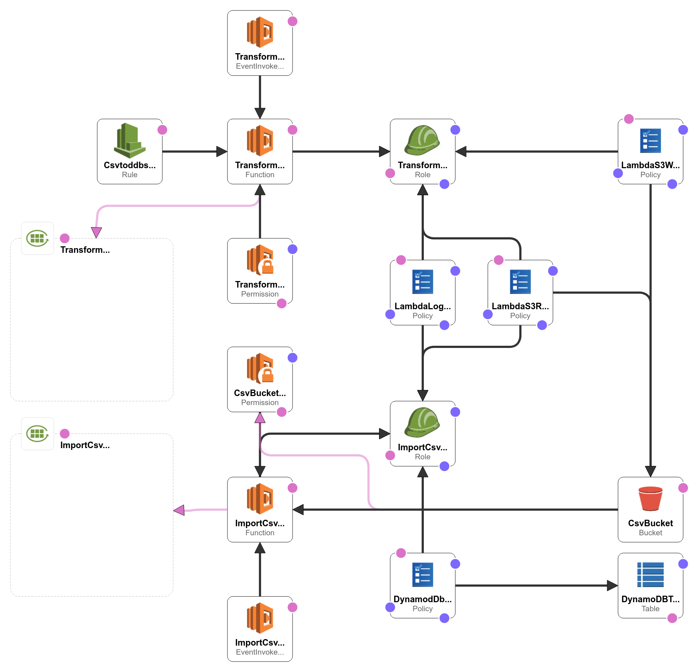

# Transform CSV data and import it to Dynamo DB
 
  

The csv-to-dbb project imports CSV data from a file in AWS S3 bucket to a Dynamo DB table.

## Use cases
* Transform CSV files on schedule
* Import CSV data to Dynamo DB

## Setup
* Edit *serverless.json* to set the deployment bucket a unique name.
* Edit *config/environment-${opt.stage}.json* to set the region, a name of a file to transform, a prefix for the transformed file, bucket, and table names.
* Edit *config/resources.json* file to configure Dynamod DB table key schema.
* Install Python and add environment variable `PYTHON=D:\Python\bin\Python.exe`
* Run `yarn install` to install CSV for Node.js and AWS-SDK dependencies.

## Deploy
In order to deploy the project, simply run the serverless deploy command with the stage option. For example:

    serverless deploy --stage staging

## Workflow
There is a CloudWatch rule that triggers TransformCsvLambdaFunction. The function takes a file from an S3 bucket, transforms data, and puts it to a file in the same bucket. The name of a new file is concatenated prefix and the source file name.
The S3 bucket triggers ImportCsvToDynamoDbLambdaFunction each time when a file with the configured prefix is created. The function reads transformed data and batch writes it to the DynamoDB table.

## Resources
AWS CloudFormation stack diagram is in the figure below. There are the S3 bucket, Dynamo DB table, two lambda functions, roles, policies, and triggers necessary to implement the workflow. 

 

## Performance
ImportCsvToDynamoDbLambdaFunction metrics importing one million CSV lines, the file size is 112 MB:
* Duration: 783659.29 ms
* Billed Duration: 783660 ms
* Memory Size: 256 MB
* Max Memory Used: 136 MB
* Init Duration: 559.44 ms

## Known issues
The shake tree plugin removes `package.json` of the @aws-sdk/client-sts dependency so it must be copied to the topmost directory manually. Migration to webpack is planned.